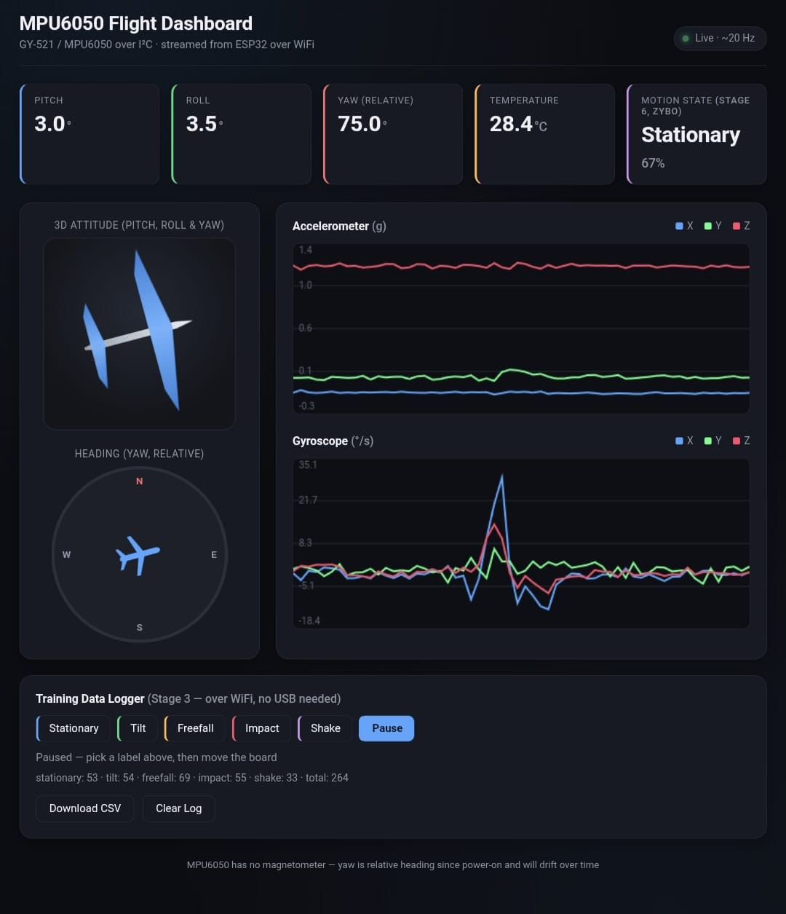
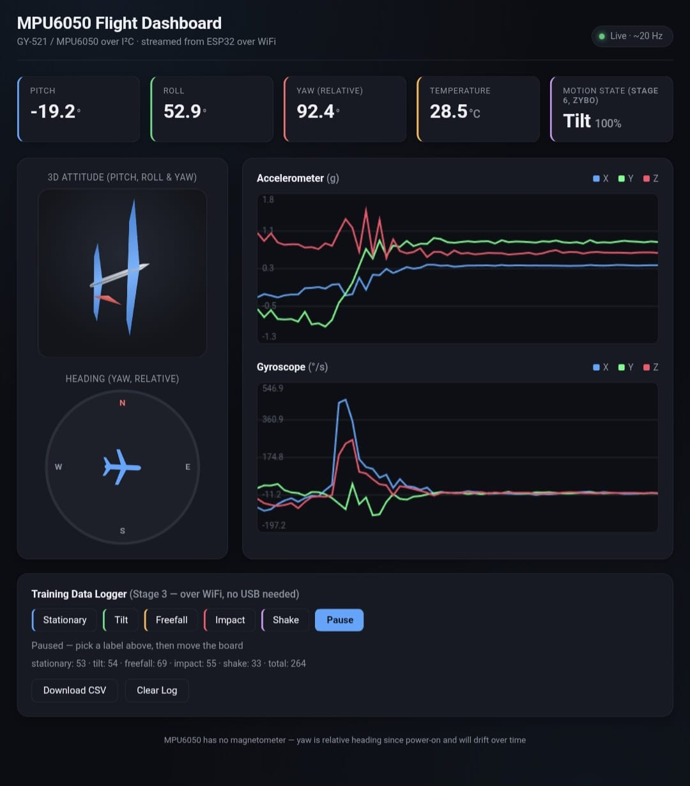
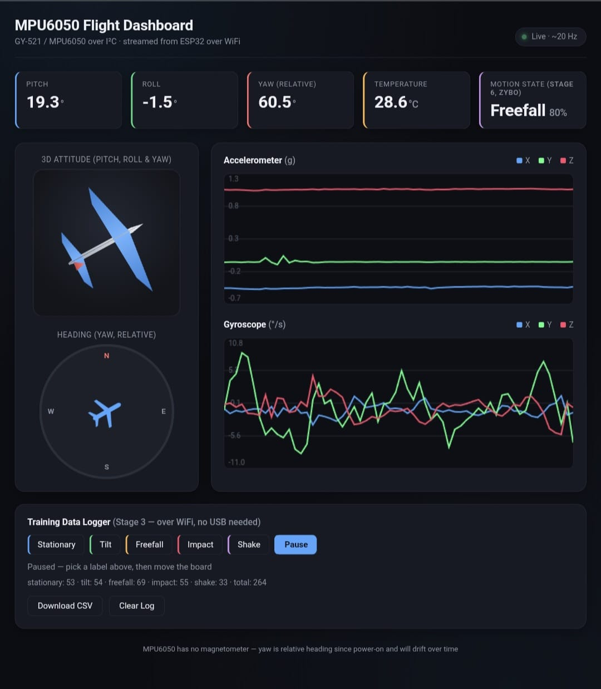
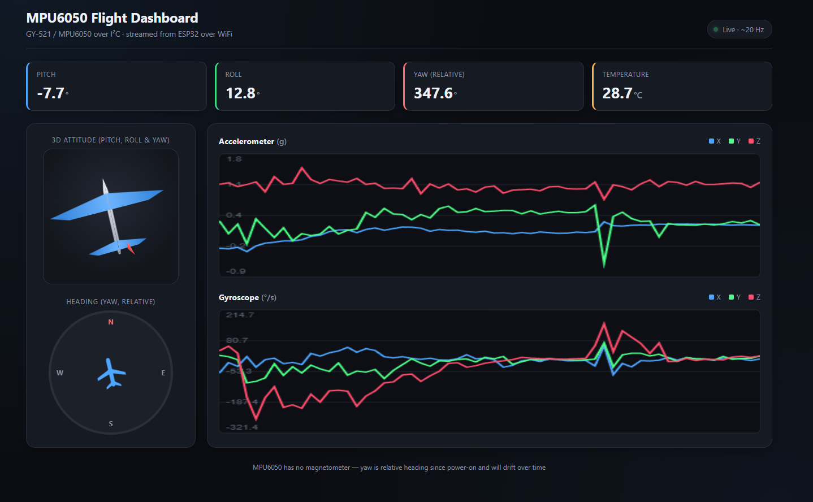

# ESP32 + Zybo Z7-10 Motion-State Classifier

An ESP32 (GY-521/MPU6050 IMU) streams a live "flight instrument" dashboard
over its own WiFi access point, extracts motion features on-device, and
ships them over UART to a Zybo Z7-10 — whose Zynq-7010 PL fabric runs a
neural net (trained in Python, converted with `hls4ml`, synthesized in
Vitis HLS) to classify the motion in real time. The classification comes
back over the same UART link and shows up live on the dashboard.

No router, no cloud, no OS on the Zynq PS — just a WiFi AP, a UART wire,
and a tiny accelerator running in ~150ns.

<p float="left">
  
  
  
</p>



## Pipeline

1. **ESP32 firmware** — reads the MPU6050 over I2C, fuses pitch/roll/yaw
   with a complementary filter, serves the dashboard over its own WiFi AP
   (`esp32_mpu6050_dashboard/`)
2. **Training data collection** — the dashboard itself doubles as a
   labeled-data logger (client-side JS, no extra tooling needed)
3. **Model training** — a ~600-parameter Keras MLP, trained in Python
   (`tools/train_classifier.py`)
4. **Quantization + HLS synthesis** — `hls4ml` converts the trained model
   to fixed-point HLS C++, Vitis HLS synthesizes it to an AXI4-Lite IP core
   (`tools/convert_hls4ml.py`)
5. **Hardware integration** — the IP is wired into a Zynq-7010 block design
   (`vivado/`), driven by a bare-metal PS application (`zybo_ps/`) that
   talks to the ESP32 over UART

## Results

- **77.4% test accuracy** across 5 classes (stationary / tilt / freefall /
  impact / shake), from 264 labeled windows collected by hand
- **Zero accuracy loss** from float32 → `ap_fixed<16,6>` quantization
  (`ap_fixed<8,3>` loses ~21 points — its 3 integer bits can't cover the
  dynamic range of the shake/impact gyro features)
- **Fits the Zynq-7010 comfortably**: DSP 47%, LUT 22%, FF 23%, BRAM 17%
  (the hls4ml default settings overflow the chip at 577% DSP — getting a
  tiny model to actually fit a tiny FPGA needed `ReuseFactor=16` +
  `Strategy=Resource`, not just a small parameter count)
- **~150ns inference latency** (29 HLS-estimated cycles), negligible next
  to the ~25-40ms sensor loop
- Weakest class: impact vs. freefall confusion (a hand-held "drop" window
  likely captures both the fall and the catch)

## Hardware

| GY-521 (MPU6050) | ESP32   |
|-------------------|---------|
| VCC                | 3.3V    |
| GND                | GND     |
| SCL                | GPIO22  |
| SDA                | GPIO21  |
| AD0                | GND (or floating) → I2C address `0x68` |

| Zybo Pmod JC | Signal | ESP32 |
|---|---|---|
| JC1 (V15) | PS UART1 txd | GPIO16 (RX2) |
| JC2 (W15) | PS UART1 rxd | GPIO17 (TX2) |
| JC5 | GND | GND |

Both links are 3.3V logic throughout — no level shifting needed anywhere
in this project.

## Software setup (ESP32 + dashboard)

1. Install board support and libraries:
   - ESP32 board package (Arduino Boards Manager)
   - `Adafruit MPU6050`, `Adafruit Unified Sensor`, `Adafruit BusIO`
     (Arduino Library Manager)
2. In `esp32_mpu6050_dashboard/`, copy `secrets.h.example` to `secrets.h`
   and set the WiFi network name/password the ESP32 will broadcast as its
   own access point:
   ```cpp
   #define SECRET_WIFI_SSID     "esp32-dashboard"
   #define SECRET_WIFI_PASSWORD "changeme123"
   ```
   Password must be 8+ characters (WPA2 minimum), or `""` for an open
   network. `secrets.h` is gitignored so your real values never get committed.
3. Open `esp32_mpu6050_dashboard/esp32_mpu6050_dashboard.ino` in the
   Arduino IDE and flash it. (Arduino requires the sketch folder name to
   match the `.ino` name, hence the nested folder.)
4. Join the WiFi network the ESP32 creates, then open `http://192.168.4.1`.

## Training data collection

The dashboard page has a **Training Data Logger** panel built in — click a
label button (Stationary/Tilt/Freefall/Impact/Shake), physically do that
motion, click **Pause** in between. It computes per-axis features
(mean/std/min/max/FFT peak) client-side from the same live sensor poll the
charts use, and keeps a running log in the browser's local storage. Click
**Download CSV** any time to save everything logged so far, and place it
at `data/training_data.csv`. Needs only the ESP32 powered and your device
joined to its WiFi — no USB connection required.

(An alternative USB-serial logger, `tools/collect_training_data.py`, is
also included — useful if you can keep the board on USB power throughout
collection, which the browser method doesn't require.)

## Training the classifier

```
pip install -r tools/requirements.txt
python tools/train_classifier.py
```

Trains a tiny Keras MLP (Dense(16) → Dense(5), ~600 params — well under
the budget a Zynq-7010 needs for a smooth `hls4ml` conversion), prints a
classification report + confusion matrix, and saves
`models/motion_classifier.h5`, `models/scaler.npz`, `models/classes.json`.

## Quantizing + converting to HLS

```
pip install -r tools/requirements-hls4ml.txt
python tools/convert_hls4ml.py            # csim + full HLS synthesis
python tools/convert_hls4ml.py --no-synth # just check quantized accuracy first
```

Targets `xc7z010clg400-1` at `ap_fixed<16,6>` / `ReuseFactor=16` /
`Strategy=Resource` by default (see Results above for why). Needs Vitis
HLS **and** Vivado installed and version-matched (Vitis HLS's synthesis
engine needs a Vivado-provided library), a C++ compiler on `PATH` for the
csim step, and a space-free output path (Vitis HLS rejects any space
anywhere in the project path — `--output-dir` defaults to
`C:\hls_builds\mpu6050_motion_classifier`, override if you'd rather use
somewhere else). See the comments at the top of `tools/convert_hls4ml.py`
for the handful of Windows-specific fixes baked into the script (bash
resolution, DLL search paths, etc.) if you hit toolchain errors.

**IP interface:** `io_parallel` (plain C array I/O) plus an AXI4-Lite
control/data interface, patched onto the generated source after
conversion (`patch_interface_to_axi_lite()` in `convert_hls4ml.py`). The
default `io_stream` interface was tried first and rejected — its AXI4-
Stream ports came out 480-bit (in) / 80-bit (out), widths no standard AXI
DMA supports. AXI-Lite lets the Zynq PS just read/write the whole feature
vector and result as memory-mapped registers directly.

## Hardware integration

`vivado/` includes the already-built block design (`design_1.bd`) and
exported hardware handoff (`design_1_wrapper.xsa`, bitstream included) —
you can skip straight to the Vitis step below using that `.xsa`, or
rebuild the block design yourself from scratch:

1. Create a project targeting the Zybo Z7-10 (`xc7z010clg400-1`), add a
   block design, add a **ZYNQ7 Processing System** block, run Block
   Automation for the board's default PS config.
2. In the PS config (MIO Configuration page), enable **UART 1** and set
   its IO dropdown to **EMIO** — the board's MIO-routed UART0 already
   goes to the USB debug console; EMIO keeps that free and routes UART1 to
   PL pins you assign to a Pmod instead.
3. **Add IP from Repository**, pointing at wherever `convert_hls4ml.py`'s
   `--output-dir` put the HLS project's `impl/ip` folder, to import the
   `myproject` IP. Add one instance to the canvas.
4. Run **Connection Automation** on the IP's `s_axi_CTRL` port — wires it
   to the PS's `M_AXI_GP0` automatically.
5. Add `vivado/constraints/mpu6050_motion_classifier.xdc` as a constraints
   source (or write your own for a different Pmod).
6. Validate design, generate bitstream, export hardware (include
   bitstream) as a `.xsa`.
7. In Vitis, create a **standalone, no-OS** platform from that `.xsa`,
   then a new application project, and add all of `zybo_ps/*.c`/`*.h`.
8. Fix the two macros at the top of `zybo_ps/main.c`
   (`MOTION_CLASSIFIER_BASEADDR`, `ESP32_UART_BASEADDR`) to match the
   actual names your generated `xparameters.h` uses. Two things that
   tripped this up and are worth checking if yours differ:
   - If your design only ends up with one enabled UART instance (e.g.
     UART0 left disabled), Xilinx renumbers it to `_0` in `xparameters.h`
     regardless of which physical UART it actually is.
   - If your BSP is built with Xilinx's newer System Device Tree flow
     (`-DSDT`), `XUartPs_LookupConfig()` takes a **base address**, not a
     `DEVICE_ID` — the classic device-ID macros aren't even generated in
     that mode. Check `xuartps.h`'s function prototype (`#ifndef SDT ...
     #else ...`) if in doubt.
9. Build, program the FPGA + PS, run.

## Project layout

| Path | Purpose |
|---|---|
| `esp32_mpu6050_dashboard/` | ESP32 firmware: sensor fusion, web dashboard, on-device feature extraction, UART link |
| `tools/collect_training_data.py` | Alternative USB-serial data logger |
| `tools/train_classifier.py` | Trains the MLP on collected data |
| `tools/convert_hls4ml.py` | Quantizes + converts the model to an HLS IP core |
| `vivado/design_1.bd` | Block design source |
| `vivado/design_1_wrapper.xsa` | Exported hardware (bitstream included) — ready to use in Vitis |
| `vivado/constraints/` | Pmod pin constraints for the ESP32 UART link |
| `zybo_ps/uart_protocol.h` | Wire protocol shared by both ends (source of truth) |
| `zybo_ps/xmyproject_hw.h` | AXI-Lite register map for the HLS IP |
| `zybo_ps/scaler_params.h` | Baked-in copy of the trained StandardScaler, for on-PS feature normalization |
| `zybo_ps/motion_classifier.c/.h` | Bare-metal driver for the IP |
| `zybo_ps/main.c` | Bare-metal app — UART framing + calls the driver above |

## Limitations

- The MPU6050 has no magnetometer, so yaw has no absolute reference — it's
  tracked as "relative heading since power-on" via gyro integration alone,
  and will slowly drift over time even at rest.
- Impact and freefall are the two most-confused classes (see Results) —
  more/cleaner training data for those two would likely help more than a
  bigger model.
